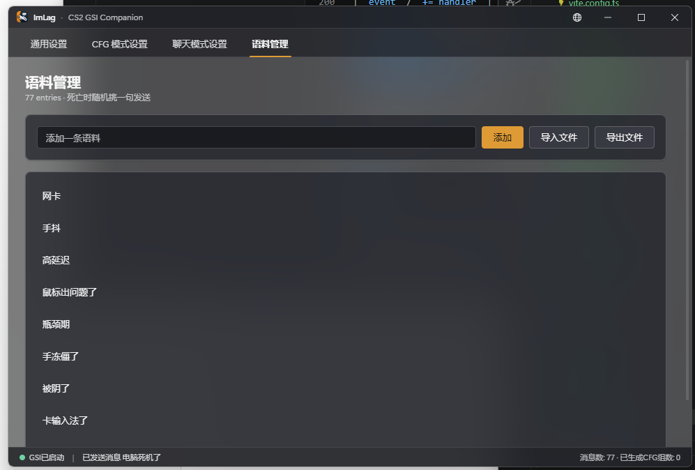

# imlag-rs

[](LICENSE)
[](https://github.com/ccc007ccc/imlag-rs/actions)

[English](README.md) · **简体中文**

> CS2 死后自动狡辩工具 · Tauri 重写版

ImLag 监听 Counter-Strike 2 的 [Game State Integration][gsi]，在你死亡的瞬间从语料库随机挑一句 _"网卡"_ / _"手抖"_ / _"走神了"_ 之类发到聊天框，**替你完成最重要的赛后心理建设**。

本仓库是 [Godot + C# 原版][orig] 的 Rust + Tauri 重写。底层的 GSI 解析独立成 [`cs2-gsi`](https://github.com/ccc007ccc/cs2-gsi) crate 单独开源。



---

## 特性

- **GSI 自动接管** — 启动时自动写入 `gamestate_integration_ImLag.cfg`，无需手动配置。
- **Win11 Acrylic UI** — Tauri 2 webview + `windowEffects: ["acrylic"]`，CS2 战术橙强调色，Fluent 2 风格。
- **三种界面语言** — `zh-CN` / `zh-TW` / `en`，标题栏地球图标一键切换。
- **语料管理** — 文件 / URL 导入（纯文本或 JSON 数组），自动去重。
- **两种触发模式**
  - **CFG 模式**：`autoexec.cfg` 中只写入一条
    `bind "<触发键>" "exec imlag_say"`。派发用的 `imlag_say.cfg` 平时为空，
    **玩家在游戏里误触触发键不会发出任何消息**。检测到死亡时 ImLag 才往
    cfg 写入一行 `say "..."` / `say_team "..."`，按一下触发键让 CS2 执行，
    约 300 ms 后再把 cfg 清空。消息通道支持 `优先全局 / 优先队内 / 随机` 三选一。
  - **聊天模式**：先松开当前所有按下的键（避免 W / Shift / Ctrl 等被
    带进聊天框），再模拟打开聊天框、粘贴消息、按下回车。
- **安全的 cfg 改动** — 修改 `autoexec.cfg` 前先备份，一键还原会清除所有 ImLag 留下的内容。
- **状态可视化** — 状态栏实时显示 GSI 在线状态、监听玩家死亡事件、生成的 CFG 组数。

---

## 快速开始

### 环境要求

| 工具 | 版本 |
|---|---|
| Rust | **1.75+**（stable） |
| Node.js | **18+**（Tauri 会驱动前端构建） |
| Tauri CLI | `cargo install tauri-cli --version "^2.0" --locked` |
| 同级仓库 | 把 `cs2-gsi` 克隆到本仓库同级目录 — `Cargo.toml` 用的是 path 依赖 |

```powershell
# 目录布局：两个仓库放在同一个父目录下
git clone https://github.com/ccc007ccc/cs2-gsi
git clone https://github.com/ccc007ccc/imlag-rs
```

### 开发模式（带热重载）

```powershell
cd imlag-rs/crates/imlag-tauri
cargo tauri dev
```

Tauri 通过 `beforeDevCommand` 自动起 `npm --prefix frontend run dev`（Vite 5173 端口）。前端改动即时生效，Rust 端改动会触发 Tauri 重启。

### 生产构建

```powershell
cd imlag-rs/crates/imlag-tauri
cargo tauri build
```

产物：

| 类型 | 路径 |
|---|---|
| 独立可执行文件 | `target/release/imlag-tauri.exe` |
| MSI 安装包 | `target/release/bundle/msi/ImLag_*_x64_*.msi` |
| NSIS 安装包 | `target/release/bundle/nsis/ImLag_*_x64-setup.exe` |

> 运行时需要 WebView2 Runtime。Win11 自带，Win10 用户可能需要从 Edge / Microsoft 下载页面安装。

### 不装 Tauri CLI

```powershell
cd crates/imlag-tauri/frontend
npm run build
cd ..
cargo run --release
```

这种方式会把当前 `dist/` 内嵌进二进制并启动，缺点是没有热重载，但省了 `tauri-cli` 的全局安装。

---

## 仓库结构

```
imlag-rs/
├── Cargo.toml                 # workspace 根
├── crates/
│   ├── imlag-core/            # 业务逻辑，无 GUI 依赖
│   │   └── src/
│   │       ├── config.rs           # AppConfig — JSON，兼容旧 PascalCase
│   │       ├── chat.rs             # 语料库（加载 / 保存 / 导入 / 随机）
│   │       ├── sender.rs           # 聊天模式按键模拟
│   │       ├── cfg_manager.rs      # CFG 模式 .cfg 生成 + autoexec patch
│   │       ├── platform/           # Win32 按键注入 / 前台窗口检测（其他平台为 stub）
│   │       ├── i18n.rs             # 后端翻译（事件 / 状态消息）
│   │       ├── events.rs           # UiEvent 广播给 webview
│   │       └── engine.rs           # 串联 cs2-gsi / corpus / sender / cfg_manager
│   └── imlag-tauri/           # Tauri 2 桌面外壳
│       ├── src/                    # Rust 端：commands / state / events 桥接
│       ├── frontend/               # Vite + React 19 + Tailwind v4
│       │   └── src/
│       │       ├── App.tsx
│       │       ├── components/     # Button / Card / Toggle / Tabs / ListItem …
│       │       ├── views/          # 通用 / CFG / 聊天 / 语料 四个 Tab
│       │       ├── layout/         # TitleBar / StatusBar
│       │       ├── lib/            # api / engine context / i18n / reveal 效果
│       │       ├── styles/         # tokens.css（CS2 调色板）/ globals.css
│       │       └── locales/        # zh-CN / zh-TW / en 字典
│       ├── icons/                  # exe / 安装包图标
│       └── tauri.conf.json
└── target/                    # cargo + tauri 产物
```

底层 GSI 协议由独立 crate [`cs2-gsi`](https://github.com/ccc007ccc/cs2-gsi) 提供（path 依赖 `../cs2-gsi`）。

---

## 配置文件

`Config.json`（首次运行自动生成；旧的 Godot `PascalCase` 键仍能通过 serde alias 加载）：

```json
{
  "playerNames": ["你的游戏名"],
  "onlySelfDeath": true,
  "triggerKey": "k",
  "cfgChatMode": "global",
  "cs2Path": "",
  "useCfgMode": true,
  "chatKey": "y",
  "keyDelay": 100,
  "skipWindowCheck": false,
  "forceMode": false,
  "language": "zh-CN",
  "autoStartGsi": true
}
```

| 字段 | 含义 |
|---|---|
| `playerNames` | 触发自动消息的玩家名（与 GSI `player.name` 比对） |
| `onlySelfDeath` | 仅当 `playerNames` 中的玩家死亡时触发 |
| `triggerKey` | CFG 模式下绑定到 `exec imlag_say` 的单个按键 |
| `cfgChatMode` | CFG 派发通道：`"global"` / `"team"` / `"random"` |
| `useCfgMode` | `true` = CFG 模式（写 cfg 派发槽 + 按触发键）；`false` = 模拟键盘直接打字 |
| `chatKey` | 聊天模式下打开聊天框的键（`y` 全局 / `u` 队内） |
| `keyDelay` | 聊天模式按键间隔 (ms)，会被钳制到 30–1000 |
| `skipWindowCheck` | 跳过 CS2 是否前台的检查（不推荐） |
| `forceMode` | 连按 3 次聊天键，应对 CS2 偶尔吞键 |
| `language` | 界面语言：`zh-CN` / `zh-TW` / `en` |
| `autoStartGsi` | 启动时自动打开 GSI 监听器 |

> 旧配置文件中的 `bindKeys` / `teamBindKeys` / `preferTeamChat` 仍能正常加载：
> 旧键池中的第一个键会迁移到 `triggerKey`，
> `preferTeamChat: true` 会迁移到 `cfgChatMode: "team"`。

`Messages.txt`：一行一条语料，UTF-8 编码。

存储位置：
1. 当前工作目录如果已有 `Config.json` 或 `Messages.txt`，就用它（兼容旧 Godot 安装方式）。
2. 否则使用 `%APPDATA%\imlag\`（或对应平台的 `directories` 路径）。

---

## 开发

```powershell
# Workspace 检查
cargo check --workspace

# Rust 测试
cargo test --workspace

# Lint
cargo clippy --workspace --all-targets -- -D warnings

# 格式化
cargo fmt --all

# 前端类型检查（不打包，最快烟雾测试）
cd crates/imlag-tauri/frontend
npm run typecheck

# 前端生产构建（只产出 dist/）
npm run build
```

### 技术栈

| 层 | 技术 |
|---|---|
| GSI 协议 | [`cs2-gsi`](https://github.com/ccc007ccc/cs2-gsi)（hyper 1.x + tokio） |
| 桌面外壳 | Tauri 2 + WebView2 |
| 前端 | React 19 + Vite 6 + TypeScript 5.6 + Tailwind v4 |
| 异步运行时 | tokio（多线程） |
| 剪贴板 | Win32 OpenClipboard（仓库内实现，未引入 `arboard`） |
| 文件对话框 | `tauri-plugin-dialog` |
| Win32 输入 | `windows` crate 0.58（按键注入、前台检测） |

---

## 鸣谢

- 原项目作者：[@cneicy/ImLag](https://github.com/cneicy/ImLag)
- 上游 GSI 思路：[antonpup/CounterStrike2GSI](https://github.com/antonpup/CounterStrike2GSI)
- 本项目使用的独立 GSI crate：[`cs2-gsi`](https://github.com/ccc007ccc/cs2-gsi)

## 许可

GPL-3.0-or-later —— 与原项目保持一致，详见 [LICENSE](LICENSE)。

[gsi]: https://developer.valvesoftware.com/wiki/Counter-Strike_Global_Offensive_Game_State_Integration
[orig]: https://github.com/cneicy/ImLag
